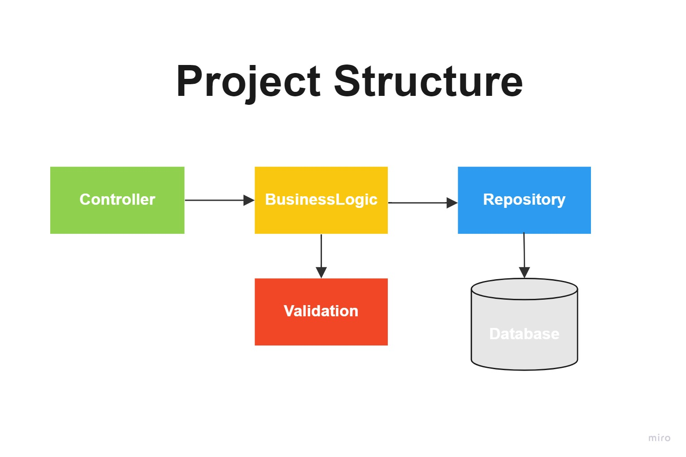

# Assignments for Java Boot Camp
* [Week 1 :: Design and Develop RESTful API with Spring Boot](https://github.com/up1/assignment-java-boot-camp/wiki/Week-01)

## Shopping-flow
### Requirement 
   1. สามารถ Search product ด้วยชื่อ Product ได้
   2. การสร้าง Basket (ตะกร้าสินค้า) สามารถใส่สินค้าได้เพียงอย่างเดียว
   3. จะ Checkout Basket ได้ต้องผ่านการสร้าง Basket มาก่อน
   4. จะ Confirm-shipping ต้องผ่านการสร้าง Checkout และ Status ของ Basket เป็น Checkout
   5. จะ Confirm-Order ต้องผ่านการ Confirm-shipping มาก่อน และ Status ของ Basket เป็น Confirm-Shipping
   6. จะดู Summary ต้องผ่านการ Confirm-Order และ Status ของ Basket เป็น Confirm-Order มาก่อน
   7. การจ่ายเงินมี 3 แบบคือ 1. บัตรเครดิต 2. เก็บเงินปลายทาง 3.บัตรเดบิต (ตอน Confirm-Order request รับได้แค่บัตรเครดิต)
   8. ไม่มี feature แนะนำสินค้า และ คูปองส่วนลดสินค้า
### Flow and Requirement design
   * [FlowAndRequirementDesign](https://miro.com/app/board/uXjVOMArmLs=/)
### Database design
   
   [Database-diagram](https://dbdiagram.io/d/620f7090485e433543d75511)
### Project structure
   

### Example API 
 * [PostmanCollection](Shopping-Assignment-1.postman_collection.json)
 * [SwaggerUI](http://localhost:8080/swagger-ui.html)

**!!! Build ไม่ได้รบกวนติดต่อกลับด้วยนะครับ !!!**
## Resources
* [Spring Boot Reference](https://spring.io/projects/spring-boot)
* https://www.baeldung.com/ 
* https://start.spring.io/
* [Git commit message](https://www.conventionalcommits.org/en/v1.0.0/)

